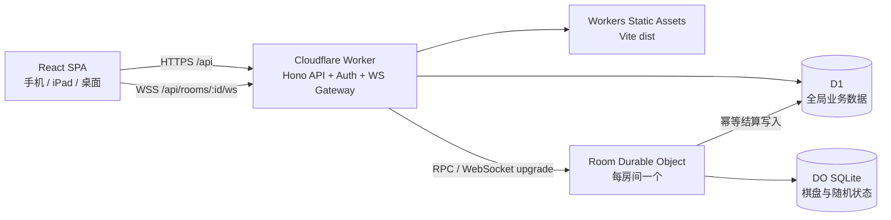

# 2048 挑战平台 V1 技术设计

<!-- markdownlint-disable MD013 -->

> - 状态：待确认（Documentation Gate）
> - 版本：V1.0-draft
> - 更新日期：2026-08-26
> - 对应需求：`requirements-v1.md`
>   实施规则：本文档获确认前，不初始化工程、不创建迁移、不修改现有原型代码。

## 1. 架构目标

本设计服务于单学校、1000 个学生账号、60 名同时参赛者的第一轮正式版本，重点保证：

1. 比赛棋盘、计时和成绩由服务端权威计算。
2. 一个房间内的加入、移动、掉线恢复和结算保持顺序一致。
3. 教师实时看到全部棋盘，学生只能得到本人棋盘。
4. React 前端、API 和 WebSocket 同源部署，减少跨域和多项目配置。
5. 所有全局业务数据可查询和导出，房间瞬时状态可从休眠或重启中恢复。
6. 核心游戏引擎和接口边界不依赖 Cloudflare 专有 API，便于未来迁移校内服务器。

## 2. 已选技术与版本策略

### 2.1 前端

- React。
- TypeScript 严格模式。
- Vite。
- React Router。
- i18next 与 react-i18next。
- Zod 共享请求与消息校验。
- Papa Parse 解析 CSV。
- ExcelJS 解析和生成 XLSX，管理页面按需加载。

实际依赖版本在开始编码时锁入 `package-lock.json`，使用当时仍受支持的稳定版本；CI 使用 Node.js 当前 Active LTS。

### 2.2 后端与平台

- Cloudflare Workers，ES Modules 模式。
- Hono 路由和中间件。
- Cloudflare Workers Static Assets 承载 Vite 构建产物。
- Cloudflare D1 保存全局业务数据。
- SQLite-backed Durable Objects 保存每个比赛房间的权威运行态。
- Durable Object WebSocket Hibernation 管理比赛连接。
- Durable Object alarm 处理倒计时切换、比赛截止和幂等结算。
- Wrangler v4 配置、开发、迁移和部署。

### 2.3 测试

- Vitest：共享引擎、业务服务和 Worker 集成测试。
- Cloudflare Vitest 集成：D1、Durable Object、alarm 和 WebSocket。
- Playwright：角色流程、双语、触控和响应式验收。

## 3. Cloudflare 架构决策

### 3.1 拓扑



### 3.2 单 Worker 而非 Pages + Worker

正式版不继续使用“Pages 静态站点 + 独立 Worker API”。单 Worker 同时提供静态资源和 API，原因是：

- 登录 Cookie、REST API 和 WebSocket 保持同源。
- D1、Durable Object 和静态资源绑定集中在一个 `wrangler.jsonc`。
- 前端路由由 SPA fallback 处理，`/api/*` 明确由 Worker 优先处理。
- GitHub Actions 只部署一个版本，避免前后端版本错配。

配置原则：

```jsonc
{
  "name": "2048-challenge-platform",
  "main": "src/worker/index.ts",
  "compatibility_date": "<implementation-date>",
  "assets": {
    "directory": "./dist",
    "binding": "ASSETS",
    "not_found_handling": "single-page-application",
    "run_worker_first": ["/api/*"],
  },
}
```

实施时使用当天兼容日期，并由 `wrangler types` 从实际绑定生成 `Env` 类型，禁止手写一份可能漂移的绑定类型。

`wrangler.jsonc` 同时声明：

- D1 binding `DB`。
- SQLite-backed Durable Object binding `ROOMS`，class 为 `RoomSession`。
- SQLite-backed Durable Object binding `LOGIN_GUARDS`，class 为 `LoginGuard`。
- 首个顺序 migration tag 通过 `new_sqlite_classes` 注册两类对象。

### 3.3 D1 与 Durable Object 的职责边界

D1 保存可跨房间查询的事实：

- 用户、密码哈希和会话。
- 团队与成员。
- 房间目录、席位和状态。
- 最终比赛成绩和练习结果。
- 导入作业摘要。

每房间 Durable Object 保存需要强一致顺序处理的运行态：

- 引擎版本和随机种子。
- 每名参赛者的棋盘、得分、最高方块、随机游标和操作序号。
- `startsAt`、`endsAt`、游戏结束和结算状态。
- WebSocket 身份附件及在线状态。

一个房间使用 `ROOMS.idFromName(roomId)` 得到唯一 Durable Object。不存在全局房间单例，因此并行房间互不阻塞。

### 3.4 官方技术依据

- [Workers Static Assets SPA routing](https://developers.cloudflare.com/workers/static-assets/routing/single-page-application/)
- [Durable Objects WebSocket best practices](https://developers.cloudflare.com/durable-objects/best-practices/websockets/)
- [Durable Object alarms](https://developers.cloudflare.com/durable-objects/api/alarms/)
- [D1 batch API](https://developers.cloudflare.com/d1/worker-api/d1-database/#batch)
- [D1 JSON query support](https://developers.cloudflare.com/d1/sql-api/query-json/)

## 4. 建议代码边界

```text
src/
  app/                 React 应用、路由、页面和状态
  components/          通用 UI 与棋盘
  i18n/                zh-CN/en 资源与词汇校验
  shared/
    contracts/         REST/WS Zod schema 与共享类型
    game/              纯 TypeScript 2048 引擎
    rules/             房间、团队、胜负规则
  worker/
    index.ts            Hono 入口和静态资源 fallback
    middleware/         会话、角色、Origin、错误封装
    routes/             API 路由
    services/           业务用例
    repositories/       D1 prepared statements
    durable-objects/    RoomSession 与 LoginGuard
    security/           密码、Cookie、令牌
migrations/             D1 迁移
tests/                  Worker 集成和 E2E 支持
```

依赖方向：

```text
React UI ───────▶ shared contracts/game
Worker routes ─▶ services ─▶ repositories / RoomSession
RoomSession ───▶ shared contracts/game
shared ────────▶ 不依赖 React、Hono、D1 或 Durable Objects
```

未来校内版本可以保留 `shared` 和服务接口，只替换 Worker 入口、D1 repository 和 Durable Object adapter。

## 5. 共享领域类型

```typescript
type Locale = "zh-CN" | "en";
type Role = "teacher" | "student";
type RoomMode = "duel" | "team_3v3";
type RoomStatus =
  "open" | "full" | "countdown" | "live" | "ended" | "cancelled";
type Direction = "up" | "down" | "left" | "right";
type MatchOutcome = "win" | "loss" | "draw";
type FinishReason = "time_limit" | "all_game_over";
```

主要对象：

```typescript
interface GameSnapshot {
  engineVersion: string;
  seq: number;
  board: number[]; // 固定 16 个整数，按行展开
  score: number;
  maxTile: number;
  maxTileReachedAt: number | null;
  validMoveCount: number;
  gameOver: boolean;
}

interface RoomSummary {
  id: string;
  code: string;
  name: string;
  mode: RoomMode;
  durationMinutes: number;
  status: RoomStatus;
  occupiedSides: number;
  capacitySides: 2;
  createdAt: string;
  startsAt: string | null;
  endsAt: string | null;
}
```

所有边界数据先经过共享 Zod schema，服务层不接收未经校验的 `unknown`。

## 6. D1 数据模型

所有时间在 D1 中保存为 UTC Unix 毫秒整数。ID 使用不可枚举的 UUID。外键迁移显式启用并测试。

### 6.1 `users`

| 字段                  | 类型    | 约束                             |
| --------------------- | ------- | -------------------------------- |
| `id`                  | TEXT    | 主键 UUID                        |
| `login_id`            | TEXT    | 唯一、非空；教师登录名或学生学号 |
| `role`                | TEXT    | `teacher` / `student` CHECK      |
| `student_no`          | TEXT    | 学生唯一；教师为空               |
| `display_name`        | TEXT    | 非空                             |
| `class_name`          | TEXT    | 学生非空；教师可空               |
| `grade_level`         | INTEGER | 既有账号可空；新导入学生为 1–12  |
| `locale`              | TEXT    | 可空；`zh-CN` / `en` CHECK       |
| `password_hash`       | TEXT    | 非空                             |
| `password_salt`       | TEXT    | 非空                             |
| `password_iterations` | INTEGER | 非空                             |
| `created_at`          | INTEGER | 非空                             |
| `updated_at`          | INTEGER | 非空                             |

约束：

- `role='student'` 时 `student_no` 和 `class_name` 必须非空。
- `role='teacher'` 时 `student_no` 必须为空。
- 学生 `login_id = student_no`。

索引：`login_id` 唯一索引、`student_no` 唯一部分索引、`class_name` 索引、学生 `(grade_level, student_no)` 部分索引。

### 6.2 `sessions`

| 字段           | 类型    | 约束                 |
| -------------- | ------- | -------------------- |
| `token_hash`   | TEXT    | 主键；不保存明文令牌 |
| `user_id`      | TEXT    | 外键 users           |
| `created_at`   | INTEGER | 非空                 |
| `expires_at`   | INTEGER | 非空                 |
| `last_seen_at` | INTEGER | 非空                 |

索引：`user_id`、`expires_at`。密码重置通过 `DELETE FROM sessions WHERE user_id=?` 使全部旧会话失效。

### 6.3 `teams` 与 `team_members`

`teams`：

| 字段         | 类型    | 约束           |
| ------------ | ------- | -------------- |
| `id`         | TEXT    | 主键 UUID      |
| `code`       | TEXT    | 唯一、系统生成 |
| `name`       | TEXT    | 唯一、非空     |
| `created_at` | INTEGER | 非空           |
| `updated_at` | INTEGER | 非空           |

`team_members`：

| 字段        | 类型    | 约束             |
| ----------- | ------- | ---------------- |
| `team_id`   | TEXT    | 外键 teams       |
| `user_id`   | TEXT    | 外键 users，唯一 |
| `joined_at` | INTEGER | 非空             |

主键为 `(team_id, user_id)`。一人一队由 `UNIQUE(user_id)` 保证；团队三人上限由事务中的计数和条件写入保证。

### 6.4 `rooms`

| 字段               | 类型    | 约束                               |
| ------------------ | ------- | ---------------------------------- |
| `id`               | TEXT    | 主键 UUID                          |
| `code`             | TEXT    | 唯一、非空                         |
| `name`             | TEXT    | 非空                               |
| `mode`             | TEXT    | `duel` / `team_3v3` CHECK          |
| `duration_minutes` | INTEGER | `DEFAULT 5 CHECK BETWEEN 1 AND 10` |
| `status`           | TEXT    | RoomStatus CHECK                   |
| `created_by`       | TEXT    | 教师外键                           |
| `engine_version`   | TEXT    | 开赛前可空                         |
| `seed`             | TEXT    | 开赛前可空                         |
| `created_at`       | INTEGER | 非空                               |
| `updated_at`       | INTEGER | 非空                               |
| `starts_at`        | INTEGER | 可空                               |
| `ends_at`          | INTEGER | 可空                               |
| `finished_at`      | INTEGER | 可空                               |
| `finish_reason`    | TEXT    | 可空；time_limit/all_game_over     |
| `winner_side`      | TEXT    | 可空；A/B/draw                     |
| `settled_at`       | INTEGER | 可空；幂等结算标志                 |

索引：`status, created_at`、`mode, status`、`code` 唯一索引。

### 6.5 `room_entries`

| 字段         | 类型    | 约束           |
| ------------ | ------- | -------------- |
| `room_id`    | TEXT    | 外键 rooms     |
| `side`       | TEXT    | A/B            |
| `student_id` | TEXT    | 1v1 使用       |
| `team_id`    | TEXT    | 3v3 使用       |
| `joined_by`  | TEXT    | 发起加入的学生 |
| `joined_at`  | INTEGER | 非空           |

主键为 `(room_id, side)`，CHECK 保证 `student_id` 与 `team_id` 恰有一个非空。

“同一学生不能加入多个活动房间”需要跨房间状态判断，由服务层通过条件查询和写入完成，并以冲突响应处理并发；最终席位的顺序一致性由房间 Durable Object 的 `join` RPC 负责，D1 记录跟随 RPC 成功结果写入。

### 6.6 `match_players`

| 字段                  | 类型    | 说明                         |
| --------------------- | ------- | ---------------------------- |
| `room_id`             | TEXT    | 房间                         |
| `user_id`             | TEXT    | 参赛学生                     |
| `team_id`             | TEXT    | 3v3 团队；1v1 为空           |
| `side`                | TEXT    | A/B                          |
| `score`               | INTEGER | 最终个人得分                 |
| `max_tile`            | INTEGER | 最终最高方块                 |
| `max_tile_reached_at` | INTEGER | 服务端时间                   |
| `valid_move_count`    | INTEGER | 有效移动数                   |
| `game_over`           | INTEGER | 0/1                          |
| `final_board_json`    | TEXT    | 16 个整数                    |
| `outcome`             | TEXT    | win/loss/draw                |
| `team_total_score`    | INTEGER | 3v3 团队总分；1v1 等于个人分 |

主键为 `(room_id, user_id)`，用于防止重复结算插入。

### 6.7 `practice_results`

| 字段               | 类型    | 说明         |
| ------------------ | ------- | ------------ |
| `id`               | TEXT    | 主键 UUID    |
| `user_id`          | TEXT    | 学生外键     |
| `engine_version`   | TEXT    | 引擎版本     |
| `score`            | INTEGER | 最终得分     |
| `max_tile`         | INTEGER | 最高方块     |
| `valid_move_count` | INTEGER | 有效移动数   |
| `final_board_json` | TEXT    | 最终棋盘     |
| `started_at`       | INTEGER | 开始时间     |
| `ended_at`         | INTEGER | 正常结束时间 |

只插入服务端回放确认已经 game over 的练习。

榜单周期查询增加 `(ended_at, user_id)` 索引；正式比赛的 `match_players` 不参与练习榜。

### 6.8 `leaderboard_periods`

| 字段         | 类型    | 说明                         |
| ------------ | ------- | ---------------------------- |
| `id`         | TEXT    | 主键 UUID                    |
| `name`       | TEXT    | 非空周期名称                 |
| `start_at`   | INTEGER | 半开区间起点，包含           |
| `end_at`     | INTEGER | 半开区间终点，不包含         |
| `created_by` | TEXT    | 创建教师                     |
| `created_at` | INTEGER | 创建时间                     |
| `updated_at` | INTEGER | 最后修改时间                 |

`end_at > start_at` 由 CHECK 保证；插入和修改触发器阻止任意两个周期重叠。服务层在周期开始后拒绝修改起止时间，但允许修改名称。

### 6.9 `import_jobs`

保存导入审计摘要，不保存原始文件：

- `id`、`type`、`checksum`。
- `row_count`、`inserted_count`、`updated_count`。
- `created_by`、`committed_at`。

预览错误只在响应中返回，避免永久保存包含姓名和学号的错误文件副本。

## 7. 认证与安全

### 7.1 密码

- 使用 Web Crypto PBKDF2-HMAC-SHA-256。
- 每个用户使用随机盐。
- 迭代成本是服务端配置，哈希记录同时保存所用迭代数，允许以后渐进升级。
- 新密码验证成功后，如果记录成本低于当前配置，可在后台重新哈希。
- 统一学生初始密码、教师初始密码和会话签名密钥只存在 Cloudflare/GitHub Secrets。
- 公共仓库、前端 bundle、日志、导入文件和 D1 不保存统一初始密码明文。

按产品决定，第一轮不强制学生首次登录改密。风险通过登录限速、通用错误和教师重置审计降低，但不能消除共享初始密码的冒用风险。

### 7.2 会话 Cookie

- Cookie 名称使用 `__Host-session`。
- 随机生成至少 256 bit 的不透明令牌。
- D1 只保存令牌 SHA-256 哈希。
- 属性：`Secure; HttpOnly; SameSite=Strict; Path=/; Max-Age=28800`。
- 8 小时绝对过期，不进行无限滑动续期。
- 退出删除当前令牌；密码重置删除该用户全部令牌。

### 7.3 请求保护

- 所有修改请求验证 `Origin` 与当前站点同源。
- 所有请求体、路径和查询参数使用 Zod 校验。
- 所有 SQL 使用 prepared statement 和 bind 参数。
- API 返回固定中文错误信封，不返回堆栈、SQL 或内部绑定信息。
- 登录失败使用 `LoginGuard` Durable Object 按 HMAC(IP + loginId) 限制连续尝试；原始 IP 不写入 D1。
- 文件解析仅在管理界面发生，服务端只接收标准化 JSON；限制文件大小、行数和字符串长度。
- WebSocket upgrade 在 Worker 中先完成会话、角色和房间资格验证，再将可信身份传给 RoomSession。

### 7.4 API 错误格式

```json
{
  "error": {
    "code": "ROOM_FULL",
    "message": "房间席位已满",
    "fields": null,
    "requestId": "..."
  }
}
```

状态码约定：

- `400`：请求无法解析。
- `401`：未登录或会话过期。
- `403`：角色或资源权限不足。
- `404`：资源不存在。
- `409`：席位、团队、唯一键或状态冲突。
- `422`：字段校验失败，包括时长边界。
- `429`：登录或高频操作限速。
- `500`：未处理的服务端错误。

错误消息固定中文；错误码稳定，前端不得用消息文本判断业务分支。

## 8. REST API

所有响应为 JSON，导出接口除外。列表统一使用 `page`、`pageSize`，默认 1/20，最大每页 100。

### 8.1 认证与当前用户

| 方法  | 路径               | 角色   | 行为                        |
| ----- | ------------------ | ------ | --------------------------- |
| POST  | `/api/auth/login`  | 公共   | 登录并设置 Cookie           |
| POST  | `/api/auth/logout` | 已登录 | 注销当前会话                |
| GET   | `/api/me`          | 已登录 | 返回当前用户、角色和 locale |
| PATCH | `/api/me/locale`   | 已登录 | 保存 `zh-CN` 或 `en`        |

登录请求：

```json
{
  "loginId": "20260108",
  "password": "<secret>",
  "locale": "zh-CN"
}
```

如果用户的 `locale` 为空，登录事务使用请求 locale 初始化；已有 locale 不被登录请求覆盖。

### 8.2 教师房间 API

| 方法  | 路径                            | 行为             |
| ----- | ------------------------------- | ---------------- |
| GET   | `/api/teacher/rooms`            | 列表、搜索和筛选 |
| POST  | `/api/teacher/rooms`            | 创建公开房间     |
| GET   | `/api/teacher/rooms/:id`        | 房间详情和席位   |
| PATCH | `/api/teacher/rooms/:id`        | 修改允许字段     |
| POST  | `/api/teacher/rooms/:id/start`  | 满员后开始       |
| POST  | `/api/teacher/rooms/:id/cancel` | 取消未开赛房间   |
| GET   | `/api/teacher/rooms/:id/live`   | 实况首屏快照     |

创建请求：

```json
{
  "name": "高一三班练习赛",
  "mode": "team_3v3",
  "durationMinutes": 5
}
```

`durationMinutes` 必须是整数 1–10。首个席位加入后，PATCH 只允许修改 `name`。

### 8.3 学生房间 API

| 方法 | 路径                   | 行为             |
| ---- | ---------------------- | ---------------- |
| GET  | `/api/rooms`           | 公开房间列表     |
| GET  | `/api/rooms/:id`       | 候场详情         |
| POST | `/api/rooms/:id/join`  | 本人或整队抢位   |
| POST | `/api/rooms/:id/leave` | 本人或整队退出   |
| GET  | `/api/rooms/:id/match` | 本人比赛初始状态 |

加入和退出接口不接受由客户端指定的 side、teamId 或 participantIds；服务端从当前用户和 D1 团队关系推导。

### 8.4 用户管理 API

| 方法 | 路径                                    | 行为             |
| ---- | --------------------------------------- | ---------------- |
| GET  | `/api/teacher/users`                    | 学生列表和筛选   |
| POST | `/api/teacher/users/import/validate`    | 服务端预览校验   |
| POST | `/api/teacher/users/import/commit`      | 再校验并原子提交 |
| POST | `/api/teacher/users/:id/reset-password` | 单个重置         |
| POST | `/api/teacher/users/reset-passwords`    | 多选批量重置     |

批量重置请求最多 1000 个去重用户 ID，事务完成密码更新和会话删除。

### 8.5 团队 API

教师：

| 方法   | 路径                                     | 行为             |
| ------ | ---------------------------------------- | ---------------- |
| GET    | `/api/teacher/teams`                     | 团队列表和搜索   |
| POST   | `/api/teacher/teams/import/validate`     | 导入预览校验     |
| POST   | `/api/teacher/teams/import/commit`       | 再校验并原子提交 |
| DELETE | `/api/teacher/teams/:id/members/:userId` | 移除一名成员     |
| DELETE | `/api/teacher/teams/:id/members`         | 清空整队         |

学生：

| 方法 | 路径                  | 行为             |
| ---- | --------------------- | ---------------- |
| GET  | `/api/me/team`        | 当前团队         |
| GET  | `/api/teams/search`   | 按名称或代码查找 |
| POST | `/api/teams/:id/join` | 直接加入空位     |
| POST | `/api/me/team/leave`  | 退出当前团队     |

所有成员修改在服务端重新检查团队人数、一人一队和房间冻结。

### 8.6 成绩与练习 API

| 方法 | 路径                               | 角色 | 行为                   |
| ---- | ---------------------------------- | ---- | ---------------------- |
| GET  | `/api/me/results`                  | 学生 | 本人练习和比赛记录     |
| POST | `/api/practice/start`              | 学生 | 获取签名种子挑战       |
| POST | `/api/practice/complete`           | 学生 | 提交移动记录并回放验证 |
| GET  | `/api/teacher/results`             | 教师 | 正式比赛列表和筛选     |
| GET  | `/api/teacher/results/:roomId`     | 教师 | 单场详情               |
| GET  | `/api/teacher/results/export.csv`  | 教师 | 当前筛选 CSV           |
| GET  | `/api/teacher/results/export.xlsx` | 教师 | 当前筛选 XLSX          |
| GET  | `/api/leaderboard`                 | 学生 | 本期练习总榜和本人年级榜 |
| GET  | `/api/teacher/leaderboard-periods` | 教师 | 榜单周期历史           |
| POST | `/api/teacher/leaderboard-periods` | 教师 | 创建榜单周期           |
| PATCH | `/api/teacher/leaderboard-periods/:id` | 教师 | 修改周期或开始后改名 |
| GET  | `/api/teacher/leaderboards/practice` | 教师 | 指定周期总榜或年级榜 |

练习完成请求包含挑战令牌、操作方向列表和客户端最终摘要；服务端必须从签名种子重新执行全部操作，并仅在回放状态确实 game over 且摘要一致时保存。

## 9. 批量导入设计

### 9.1 浏览器阶段

1. 校验扩展名与 5 MiB 大小限制。
2. CSV 使用 UTF-8 解析，XLSX 只读取第一个工作表。
3. 按固定中文表头映射，学号强制转为字符串并保留文本单元格前导零。
4. 去除字段首尾空格，不修改内部字符。
5. 将标准化数组提交到 validate API。

浏览器校验只用于快速反馈，不能作为可信结果。

### 9.2 服务端预览

服务端返回：

```typescript
interface ImportPreview {
  checksum: string;
  totalRows: number;
  insertCount: number;
  updateCount: number;
  errors: Array<{
    row: number;
    field: string | null;
    code: string;
    message: string; // 固定中文
  }>;
}
```

checksum 是标准化 JSON 的 SHA-256，用于确认用户提交的预览和 commit 内容一致。

### 9.3 原子提交

commit 重新发送标准化行和 checksum。服务端重新规范化、重新计算 checksum、重复全部校验后才写入。

为保持大文件原子性，不按每行生成无限数量的独立 D1 statement。实现使用 D1 JSON 函数：

- 将已校验数组作为单个 JSON bind 参数。
- 使用 `json_each(?)` 展开为行。
- 学生导入以单条 `INSERT ... SELECT ... ON CONFLICT DO UPDATE` 完成。
- 团队导入用固定数量的 prepared statements 完成团队 upsert、目标团队成员删除和新成员插入，并放入一个 `DB.batch()`。
- 导入审计记录与业务写入处于同一 batch。

任何 statement 失败则整批回滚；禁止在多个独立 batch 之间声称全局原子性。

## 10. 房间一致性与并发

### 10.1 命令归属

所有会改变房间参与者或比赛状态的命令进入对应 RoomSession Durable Object：

- `joinParticipant`。
- `leaveParticipant`。
- `startMatch`。
- `connectPlayer` / `connectTeacher`。
- `applyMove`。
- `cancelRoom`。
- `finalizeMatch`。

RoomSession 串行处理同一房间命令，避免最后席位、开始和结算竞争。

### 10.2 D1 与 RoomSession 双写

Durable Object 是活动房间的命令协调者，D1 是目录和最终成绩的查询源。写入采用可重试、幂等命令：

1. Worker 在 D1 验证用户、团队和跨房间资格。
2. Worker 调用 RoomSession RPC，携带命令 ID 和已验证主体。
3. RoomSession 以命令 ID 去重并提交本地 SQLite 状态。
4. RoomSession/Worker 以同一命令 ID 更新 D1 房间目录。
5. 客户端以 RoomSession 返回状态为准；D1 同步失败时安全重试，不重复占位。

RoomSession 保存最近命令结果，D1 对 `(room_id, side)` 和结算主键提供最终唯一约束。

### 10.3 跨房间唯一参与

加入前查询目标学生涉及的所有 `open/full/countdown/live` 房间。3v3 对团队三名成员一起检查。发现任一活动房间即返回 409。

首轮规模下冲突窗口通过以下组合关闭：

- 每个学生的活动房间占位使用 D1 条件写入和唯一活动占位记录。
- 目标房间最终席位由 RoomSession 串行分配。
- 任一阶段失败都执行幂等补偿并返回冲突，不向客户端展示暂态成功。

实现迁移时增加 `active_participations(user_id PRIMARY KEY, room_id, side)`，仅保存活动状态；退出、取消或结算时删除。它使“一人一个活动房间”成为数据库唯一约束，而不是仅靠查询判断。

3v3 加入在一个事务中插入三名成员的活动参与记录，任一冲突整组失败。

## 11. RoomSession Durable Object

### 11.1 标识与存储

- DO ID：`ROOMS.idFromName(roomId)`。
- 使用 `new_sqlite_classes` 创建 SQLite-backed class。
- 构造函数只创建/迁移轻量本地表，不加载全部棋盘到长期内存。
- 关键状态全部写入 DO SQLite，不能只保存在类字段。

DO 本地表：

- `room_meta`：mode、duration、status、seed、engineVersion、startsAt、endsAt、settled。
- `participants`：userId、teamId、side、display metadata。
- `game_states`：board、score、maxTile、maxTileAt、rngState、seq、moveCount、gameOver。
- `processed_commands`：短期命令幂等键和结果。

### 11.2 开赛

教师 start 命令满足 `status=full` 时：

1. 使用 Web Crypto 生成房间随机种子。
2. 固定本房间 `engineVersion`。
3. 设置 `startsAt = now + 3000`。
4. 设置 `endsAt = startsAt + durationMinutes × 60000`。
5. 为每名参赛者使用同一 seed 初始化独立游戏状态。
6. 持久化全部状态。
7. 将 Durable Object alarm 先设置为 `startsAt`。
8. 广播倒计时状态。

`startsAt` alarm 将房间从 `countdown` 切换到 `live`，同步 D1 后把下一次 alarm 设置为 `endsAt`。如果 alarm 稍有延迟，第一条在 `startsAt` 之后到达的读取或移动命令也会幂等执行同一状态切换。

不使用 `setTimeout` 或 `setInterval` 决定开赛或比赛结束。客户端倒计时只是 `startsAt` / `endsAt` 与 `serverNow` 的差值显示。

### 11.3 移动处理

学生消息：

```json
{
  "type": "move",
  "seq": 17,
  "direction": "left"
}
```

处理顺序：

1. 从 WebSocket attachment 读取可信 `userId` 和连接代次。
2. 校验房间是 `live` 且 `now < endsAt`。
3. 校验该连接是该学生最新的可操作连接。
4. 校验 seq 恰为服务端期望值。
5. 用共享引擎执行移动。
6. 无效移动只确认序号，不生成方块或增加有效移动数。
7. 有效移动更新棋盘、分数、最高方块时间、随机状态和有效移动数。
8. 在广播前持久化权威状态。
9. 只向学生返回本人状态；向教师连接广播全体摘要。
10. 如果全部参与者 game over，调用幂等结算。

学生状态：

```json
{
  "type": "player_state",
  "serverNow": 1787700000000,
  "startsAt": 1787700003000,
  "endsAt": 1787700303000,
  "state": {
    "seq": 17,
    "board": [0, 2, 4, 8, 0, 0, 0, 0, 0, 0, 0, 0, 0, 0, 0, 0],
    "score": 16,
    "maxTile": 8,
    "maxTileReachedAt": 1787700011000,
    "validMoveCount": 5,
    "gameOver": false
  }
}
```

学生消息中不包含对手、队友或团队总分。

### 11.4 教师快照

教师连接接收：

```typescript
interface TeacherRoomSnapshot {
  type: "teacher_snapshot";
  room: {
    status: RoomStatus;
    startsAt: number | null;
    endsAt: number | null;
    sideTotals: { A: number; B: number };
  };
  players: Array<{
    userId: string;
    name: string;
    className: string;
    teamName: string | null;
    side: "A" | "B";
    connected: boolean;
    state: GameSnapshot;
  }>;
}
```

教师快照可合并短时间内的多步更新，避免每个移动向所有教师连接发送多条零碎消息；不得延迟权威落盘。

### 11.5 WebSocket 休眠与重连

- 使用 `ctx.acceptWebSocket()`，不使用标准 `ws.accept()`。
- attachment 保存 `userId`、`role`、`roomId` 和连接代次。
- DO 从 SQLite 重建棋盘，不依赖休眠前内存。
- 客户端使用指数退避重连，最高间隔 30 秒。
- 重连成功先发送完整权威快照，再接受新移动。
- 同一学生新连接成功后，旧连接收到只读/关闭通知，不能继续提交移动。

### 11.6 截止与结算

alarm 处理两个阶段，并始终从持久化状态判断应执行的动作：

1. 读取持久化 status、`startsAt`、`endsAt` 和 `settled`。
2. 状态为 `countdown` 且已到 `startsAt`：幂等切换为 `live`、同步 D1、广播开赛，并把 alarm 设置为 `endsAt`。
3. 状态为 `countdown` 且尚未到 `startsAt`：重新设置 `startsAt` alarm。
4. 状态为 `live` 且尚未到 `endsAt`：重新设置 `endsAt` alarm。
5. 已结算则直接成功返回。
6. 状态为 `live` 且已到 `endsAt`：将房间切换为不可移动状态。
7. 按模式计算双方总分和 tie-break。
8. 以 `(room_id, user_id)` upsert 最终选手结果。
9. 更新 D1 rooms 的 winner、finishReason 和 `settled_at`。
10. 删除 `active_participations`。
11. 持久化本地 settled 标志。
12. 广播最终结果。

Cloudflare alarm 可能重试，因此倒计时切换和步骤 8–11 必须可重复执行且结果相同。

提前结束调用同一结算函数，`finishReason=all_game_over`，并删除尚未触发的 alarm。

## 12. 共享 2048 引擎

### 12.1 纯函数接口

```typescript
interface EngineState {
  version: string;
  board: number[];
  score: number;
  rngState: number[];
  maxTile: number;
  validMoveCount: number;
}

function createGame(seed: string, version: string): EngineState;
function applyMove(
  state: EngineState,
  direction: Direction,
): { state: EngineState; changed: boolean; mergedScore: number };
function isGameOver(state: EngineState): boolean;
```

引擎不得读取 `Date.now()`、DOM、网络或 Cloudflare binding。最高方块时间由调用方在有效移动后记录。

### 12.2 标准规则

- 4×4 棋盘。
- 开局两个方块。
- 新方块为 2 或 4，概率分别为 90% 和 10%。
- 方块位置从空格列表按确定性随机值选择。
- 每一步每个方块最多合并一次。
- 得分增加量等于当步所有新合并方块的数字之和。
- 无效移动不消耗随机数。

### 12.3 版本化

引擎导出常量 `ENGINE_VERSION`。房间和练习挑战都持久化版本。修复会改变棋盘结果的算法时必须增加版本，并保留旧版本回放能力，不能用新算法重算历史成绩。

## 13. 个人练习验证

个人练习在浏览器本地运行以保证触控即时响应，但不能直接信任客户端最终得分。

流程：

1. `/api/practice/start` 返回 `engineVersion`、随机 seed、startedAt 和 HMAC 签名挑战令牌。
2. 浏览器用共享引擎运行并记录方向序列。
3. 只有本地判断 game over 后才能提交 complete。
4. Worker 验证令牌、用户和引擎版本。
5. Worker从 seed 重放全部方向。
6. 回放结果必须 game over，且得分、最高方块、移动数和最终棋盘与提交摘要一致。
7. 以挑战 ID 做幂等键保存一次结果。

刷新、退出或重新开始不调用 complete，不产生记录。移动日志验证后不长期保存。

## 14. 前端架构

### 14.1 路由与角色保护

- 应用启动先请求 `/api/me`。
- 未认证路由只允许 `/login`。
- 教师路由和学生路由分别使用角色 guard。
- `/match/:roomId` 根据当前角色加载学生状态或教师实况。
- 路由不存在时显示本地化 404，并提供返回本角色首页按钮。

### 14.2 状态分层

- 服务端数据：使用查询缓存层管理 REST 列表和详情；修改成功后按资源失效。
- 当前用户和 locale：应用级 Context。
- 比赛状态：专用 WebSocket store，保存权威快照、预测队列和连接状态。
- 表单：本地表单状态，提交前 Zod 校验。
- 个人练习：本地引擎 store；不写 Local Storage，刷新即放弃。

不把密码、会话令牌、权威比赛棋盘或导入原始文件写入 Local Storage。

### 14.3 国际化

- `zh-CN` 和 `en` 使用同一扁平键集合。
- CI 脚本比较递归 key path，发现缺失、多余或空翻译即失败。
- 组件只调用翻译 key，不使用语言条件分支拼接句子。
- API 错误和操作通知直接显示固定中文服务端消息，不放入翻译资源。
- 日期使用 `Intl.DateTimeFormat(locale)`，数字使用 `Intl.NumberFormat(locale)`。
- 切换 locale 同步更新 i18next、`document.documentElement.lang` 和可见 ARIA 文本。
- 未登录偏好键为 `ui-locale`；不含任何账号信息。
- 登录态切换乐观更新界面，再调用 `PATCH /api/me/locale`；失败时回滚并显示中文错误。

### 14.4 触控棋盘

- 使用 Pointer Events，棋盘设置 `touch-action: none`。
- 只接受 primary pointer；第二根手指出现时取消本次手势。
- 记录 pointerdown 起点，在 pointerup 计算位移。
- 最小有效位移 24 CSS px。
- 主轴位移至少为副轴的 1.2 倍，否则判定方向不明确。
- 每次 pointerdown/pointerup 最多发送一个移动。
- `pointercancel` 不发送移动。
- 手机与 iPad 不渲染方向键组件。
- 桌面键盘只在比赛或练习棋盘聚焦且没有文本输入焦点时响应方向键/WASD。

### 14.5 客户端预测

- 输入立即用共享引擎生成预测动画。
- 每个输入附带严格递增 seq。
- 服务端快照到达时按 seq 确认或回滚。
- 重连、seq 缺口、引擎版本不匹配或服务端拒绝移动时立即丢弃预测队列并使用完整权威快照。
- 预测状态永远不用于成绩提交或教师实况。

## 15. 成绩查询与导出

### 15.1 查询

教师成绩查询以 rooms 连接 match_players、users 和 teams，一次查询返回分页结果，避免逐行 N+1 查询。

索引覆盖：

- `rooms(status, finished_at)`。
- `match_players(user_id, room_id)`。
- `match_players(team_id, room_id)`。
- `users(class_name, student_no)`。

学生个人记录分别查询 match_players 和 practice_results，在服务层归一为按时间倒序的联合结果。

### 15.2 练习榜单查询与隐私

榜单查询先按周期 `[start_at, end_at)` 筛选 `practice_results`，再用窗口函数为每名学生选择最佳记录，随后按得分降序、最高方块降序、有效移动数升序执行 `RANK()`。完成时间和记录 ID 仅用于稳定选择与展示顺序，不参与并列判定。总榜和年级榜执行独立查询，不从 `class_name` 推断年级。

学生查询只保留名次不大于 20 的记录及当前用户；因此第 20 名并列者全部保留，本人榜外时也能返回。学生响应在 Worker 内映射为班级、脱敏姓名、学号后 6 位、得分、最高方块和本人标记，不序列化完整身份、有效移动数、完成时间或最终棋盘。教师响应保留完整复核字段。

### 15.3 导出

- 导出复用与列表相同的服务端筛选 schema，不接受客户端传入任意 SQL 字段。
- CSV 使用 UTF-8 BOM，确保中文在常见表格软件中正确显示。
- XLSX 由固定列定义生成，不包含公式，不把用户输入解释为公式。
- 对以 `=`, `+`, `-`, `@` 开头的文本单元格进行安全转义，防止 CSV/XLSX 公式注入。
- 时间统一格式化为 `YYYY-MM-DD HH:mm:ss`，时区 Asia/Shanghai。

## 16. 测试设计

### 16.1 共享引擎单元测试

- 四个方向移动和压缩。
- 单次与连续合并。
- 每步只能合并一次。
- 无效移动不生成方块、不消耗随机数。
- 同 seed、版本和输入序列产生完全相同状态。
- 游戏结束判断。
- 得分和最高方块。
- 旧引擎版本回放固定用例。

### 16.2 规则与数据测试

- 时长合法值 1/5/10；非法值 0/11/-1/1.5/字符串/缺失。
- 用户和团队导入的重复、缺字段、前导零、成员不存在和跨团队冲突。
- 预览 checksum 不一致被拒绝。
- 导入中途约束失败时业务表和 import_jobs 均无部分写入。
- 团队三人上限、一人一队和比赛冻结。
- 密码重置使全部旧会话失效。
- 教师和学生 API 权限矩阵。

### 16.3 Durable Object 测试

- 两个并发请求抢最后席位，只有一个成功。
- 3v3 三名成员原子占用活动参与记录。
- 满员且离线时教师可以开赛。
- 三秒倒计时不计入比赛时长。
- 1 分钟和 10 分钟绝对截止。
- alarm 重试不产生重复成绩。
- 全员 game over 提前结算。
- hibernation 后从 SQLite 恢复状态。
- 多标签页新连接接管，旧连接无法移动。
- 学生消息不泄露他人状态，教师消息包含完整快照。

### 16.4 Playwright E2E

中文和英文分别覆盖：

- 登录和语言持久化。
- 教师创建 1 分钟与 10 分钟房间。
- 学生 1v1 抢位、教师开赛和结果入库。
- 两个完整团队加入 3v3。
- 教师查看六个棋盘并放大个人棋盘。
- 用户导入预览、提交和密码重置。
- 团队搜索、加入、退出和冻结。
- 教师成绩筛选和导出。

视口：360×800、390×844、768×1024、1024×768、1440×900。

触控 E2E 必须真实派发 pointer 手势，并验证棋盘外页面仍可滚动。

### 16.5 容量测试

- 导入 1000 个学生并验证列表、搜索和登录。
- 60 个学生 WebSocket 连接混合分布在 1v1 和 3v3 房间。
- 持续发送合理课堂速度的移动，同时打开教师实况。
- 验证无重复结算、无跨房间状态串扰、连接恢复正常。

容量测试验证正确性和响应分位，不承诺未经真实公网压测得到的延迟数字。

## 17. CI/CD 与环境

### 17.1 Pull Request CI

顺序执行：

1. `npm ci`。
2. 格式与 lint 检查。
3. TypeScript 类型检查。
4. i18n key 完整性检查。
5. Vitest 单元和 Worker 集成测试。
6. Vite 生产构建。
7. Playwright 关键流程。
8. `wrangler deploy --dry-run`。

任一步失败则 PR 不允许进入部署阶段。

### 17.2 生产部署

合并 `main` 后：

1. 检出精确 commit。
2. `npm ci` 和重复必要 CI 检查。
3. 应用 D1 远程迁移。
4. 执行 `wrangler deploy`。
5. 对部署返回的版本和 `workers.dev` URL 执行未认证及认证 smoke test。
6. 记录 Git SHA、Worker version 和迁移列表。

D1 迁移在 Worker 部署前必须向后兼容当前线上代码；不能在同一部署中先删除旧代码仍需要的列。

Durable Object migration 使用唯一顺序 tag；禁止使用 `deleted_classes` 清理数据。部署前执行 dry run。

### 17.3 Secrets

GitHub Actions：

- `CLOUDFLARE_API_TOKEN`。
- `CLOUDFLARE_ACCOUNT_ID`。

Cloudflare Worker secrets：

- `SESSION_SECRET`。
- `PRACTICE_SIGNING_SECRET`。
- `LOGIN_RATE_LIMIT_SECRET`。
- `BOOTSTRAP_TEACHER_LOGIN`。
- `BOOTSTRAP_TEACHER_PASSWORD`。
- `INITIAL_STUDENT_PASSWORD`。

启动教师账号的命令必须幂等：账号已存在时不修改密码，除非调用明确的受控重置命令。

### 17.4 现有 Pages PR

当前 PR #1 只部署静态 Pages 原型，不能作为正式全栈部署方案。它保持不动，直到：

1. 本文档获确认。
2. 全栈 Worker 分支通过本地与 CI 验证。
3. 新 Worker 部署工作流准备就绪。

届时只在用户明确同意后将 PR #1 标记为被新方案取代或关闭。

## 18. 可观测性与恢复

- Worker 输出结构化日志：requestId、route、status、duration、userId 哈希、roomId 和 errorCode。
- 日志不得包含密码、Cookie、原始导入行、完整姓名列表或棋盘移动日志。
- RoomSession 记录开赛、截止、提前结束、结算重试和重连事件。
- 客户端错误提示使用 requestId，方便教师反馈问题。
- D1 使用迁移管理和平台恢复能力；任何人工恢复都需要独立操作记录和部署后验证。
- 线上可达性、部署版本、认证 API、WebSocket 和浏览器视觉流程分别验收，不能以静态首页 HTTP 200 替代全栈验收。

## 19. 边界与后续迁移

第一轮只交付 Cloudflare `workers.dev` 环境，不交付校内服务器运行包。

为未来迁移保留以下端口：

```typescript
interface UserRepository {
  /* 用户、会话和密码重置 */
}
interface TeamRepository {
  /* 团队和成员事务 */
}
interface RoomRepository {
  /* 房间目录、占位和成绩 */
}
interface RoomCoordinator {
  /* join/start/move/connect/finalize */
}
interface Clock {
  now(): number;
}
interface SeedSource {
  createSeed(): string;
}
```

Cloudflare 实现分别是 D1 repositories、RoomSession Durable Object、系统时钟和 Web Crypto。未来校内实现可替换为 SQL 数据库、Node.js WebSocket coordinator 和本地部署配置，不改变 React 页面、共享引擎和协议语义。

## 20. 明确不实现的技术能力

- Cloudflare Pages Functions 双项目方案。
- R2、KV、Queues、Workers AI 或第三方身份提供商。
- 服务端视频或屏幕流。
- 聊天、语音、通知和观战广播。
- 排名计算和积分体系。
- 多租户数据库和学校级隔离。
- 成绩编辑、删除和管理员审计 UI。
- 自定义域名和中国大陆生产网络优化。

## 21. 实施门槛

收到产品对 `requirements-v1.md` 与本文档的明确确认后，编码阶段按以下顺序启动：

1. 从最新 `main` 创建新的全栈功能分支。
2. 初始化 React/Vite/Worker 工程和共享类型。
3. 先实现共享引擎、D1 迁移和认证测试。
4. 实现用户、团队与房间 REST 流程。
5. 实现 RoomSession、WebSocket、alarm 与客户端预测。
6. 实现双语页面、触控、导入和成绩导出。
7. 完成完整测试、GitHub CI 和 `workers.dev` 验收。

确认前，本仓库只允许包含本轮文档变更。
