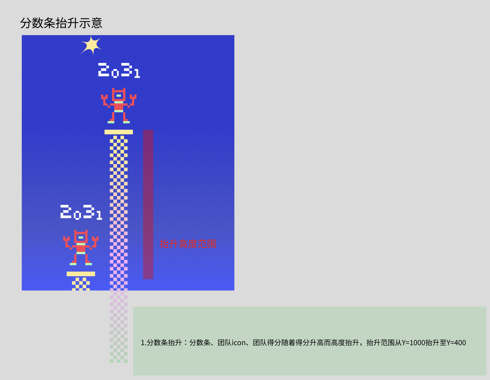
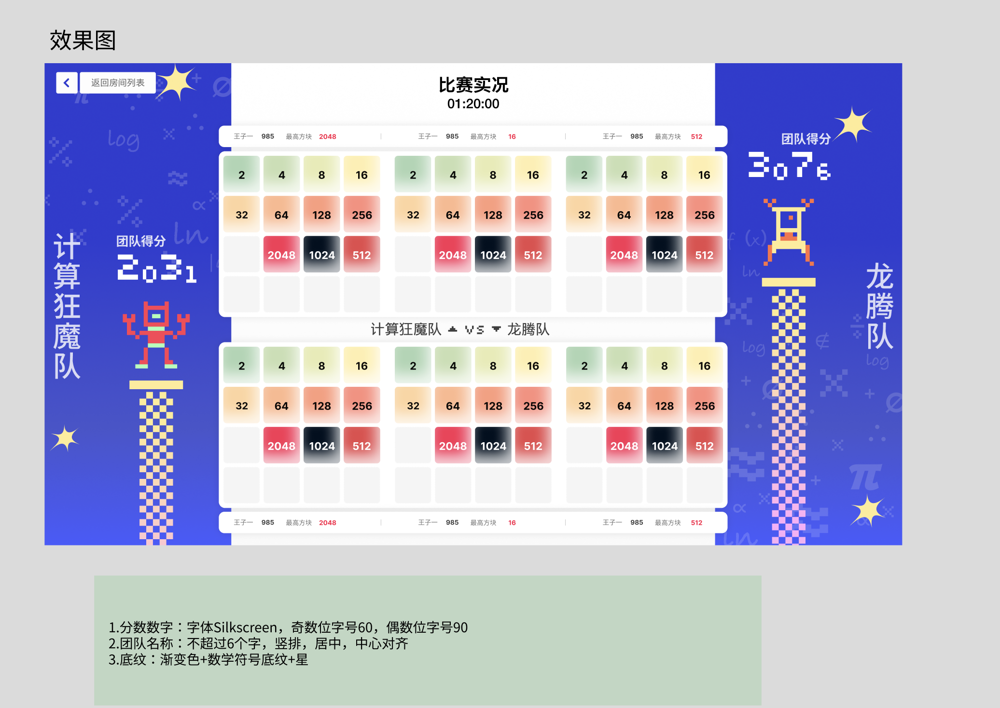
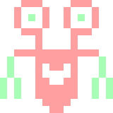
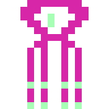
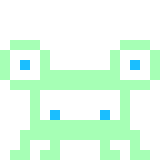
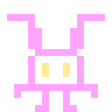
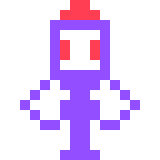
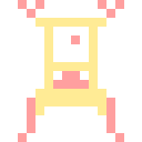
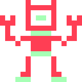
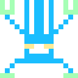

# TODO：正式上线、比赛直播、团队图标与离线淘汰赛

状态：待实现。本文用于跟踪需求，所有复选框仅在完成实现与验收后勾选。

## 1. 正式域名使用 mingcheng2048.cn

- [ ] 正式站点使用 `https://mingcheng2048.cn`。
- [ ] 更新正式域名绑定、部署配置和相关入口文档。
- [ ] 验收：通过该域名可以正常登录、访问页面、调用 API 并连接比赛 WebSocket。

## 2. preview 页面切换到正式环境

- [ ] 将当前 preview 展示的页面版本发布到正式环境，成为正式页面。
- [ ] 页面使用正式环境的登录、API 和 WebSocket。
- [ ] 验收：通过正式域名看到 preview 的页面版本，使用正式账号完成登录、比赛及成绩查看。
- [ ] 上线前核对正式环境的数据和密钥绑定，避免将测试数据、测试账号或测试密钥带入正式环境。

## 3. preview Logo 从 1024 改为 2048

- [ ] 将 preview 页面中显示的品牌 Logo 从 1024 改为 2048，并随页面版本上线。
- [ ] 使用随本 PR 保存的用户附件 [通用-Logo.svg](assets/mingcheng2048-logo.svg) 作为品牌视觉参考。
- [ ] 验收：登录页、导航等展示该品牌 Logo 的位置统一显示 2048，中文、英文与移动端均正确。

附件为原始 SVG，内容原样保存；此品牌 Logo 与各团队自身的 Logo 分别使用。

## 4. 比赛直播页面支持全屏切换

- [ ] 比赛直播页面提供进入全屏和退出全屏的操作。
- [ ] 退出全屏（包括浏览器退出和 Esc）时，按钮状态与实际状态一致。
- [ ] 全屏下比分、计时、团队信息和棋盘布局适配可用空间。
- [ ] 验收：正常模式与全屏模式可以反复切换，实时比分、计时和 WebSocket 更新持续正常；不支持全屏的浏览器有明确反馈。

## 5. 比赛直播页展示真实团队 Logo 与柱顶小人

- [ ] 两侧展示对应团队实际选择的 Logo（团队小人），与团队管理页一致；没有 Logo 时显示明确的默认标识。
- [ ] 团队小人站在各自记分柱的柱顶，团队得分显示在小人上方。
- [ ] 得分升高时，记分柱、柱顶平台、团队图标和团队得分作为一组同步抬升。
- [ ] 抬升范围按设计稿从 Y=1000 至 Y=400；在其他视口和全屏模式中按布局比例换算，最高位置保留比分与图标的完整显示空间。
- [ ] 实现时明确得分与柱高的映射；同一得分使用相同尺度，得分增加时柱顶向上移动并限制在上述范围内。
- [ ] 记分柱使用设计稿的棋盘格纹理与渐变配色，柱顶保留黄色平台。
- [ ] 团队分数字体使用 Silkscreen；奇数位数字字号 60，偶数位数字字号 90（设计稿单位，随视口等比适配）。
- [ ] 两侧团队名称展示不超过 6 个字，竖排、居中并沿各自侧栏中心对齐；较长名称需要明确展示处理，保留真实团队名称。
- [ ] 两侧背景遵循效果图：蓝色渐变、数学符号底纹及星形装饰。
- [ ] 中央保留比赛标题、实时计时与两队各三个棋盘的对战布局；棋盘旁显示玩家名称、得分和最高方块。
- [ ] 验收：双方使用不同团队 Logo 时显示正确；连续得分更新中，比分、图标和柱顶同步移动，小人的脚与柱顶保持设计稿中的固定间距。
- [ ] 验收：低分与高分、普通与全屏模式下，比分、团队图标、柱顶及队名均无裁切或相互遮挡；比分使用实时数据，效果图数字仅作示例。

### 设计参考

[Figma 原始设计](https://www.figma.com/design/Ndz9rm1sP1nX7ucGtID9tg?node-id=0-1)。

两张用户提供的 PNG 原样保存，作为后续实现与视觉验收参考。当前 Figma 连接器提示缺少编辑权限，未读取源设计节点；以上尺寸及说明依据附件，Y 坐标和字号均为设计稿单位。

“小人高度变化”指团队图标随柱顶的纵向位置变化；抬升过程中保持图标自身的设计尺寸与比例。

## 6. 创建团队时的图标库更新为附件 team_logos.zip

- [ ] 将创建团队时的可选图标库替换为附件中的 9 个 SVG 图标（icon1.svg 至 icon9.svg），保留原始图案和配色。
- [ ] 图标选择器直接展示这些 SVG，支持明确的选中状态；提交创建后保存所选图标。
- [ ] 团队创建后，团队详情、团队列表和比赛直播页均显示同一个所选图标。
- [ ] 兼容已有团队的旧图标记录，保证升级后能正常显示。
- [ ] 验收：9 个图标逐一可选，创建并刷新后选择仍正确；团队列表和直播页与创建时的选择一致，桌面、移动端与 iPad 无图标变形或裁切。

素材原样保存在 [docs/assets/team-logos](assets/team-logos/)；压缩包中的 macOS 元数据不作为图标素材。

| 图标 | 预览 |
| --- | --- |
| icon1.svg |  |
| icon2.svg |  |
| icon3.svg |  |
| icon4.svg |  |
| icon5.svg |  |
| icon6.svg |  |
| icon7.svg |  |
| icon8.svg |  |
| icon9.svg |  |

## 7. 离线淘汰赛晋级页面（总共 8 队 / 总共 4 队）

用户已确认：“8 / 8”和“4 / 4”分别指总共 8 支队伍与总共 4 支队伍。

- [ ] 制作两版可离线运行的淘汰赛晋级页面：8 队版展示 8 → 4 → 2 → 冠军；4 队版展示 4 → 2 → 冠军。
- [ ] 管理员可从线上导出团队名称、团队 Logo 及名称与 Logo 的对应关系，放入离线页面约定的指定目录。
- [ ] 导出内容包含实际 Logo 文件，离线页面无需连接线上服务即可读取和展示。
- [ ] 在页面的队伍位置填写团队名称时，自动匹配导出资料并切换为对应团队 Logo；更改名称时同步更新图标。
- [ ] 未找到名称、名称重复或 Logo 缺失时给出明确提示，避免保留上一支团队的错误图标。
- [ ] 支持填写或选择各轮晋级队伍，晋级位置同步显示对应名称与 Logo，直至冠军。
- [ ] 随交付提供导出、目录放置及离线打开页面的操作说明。

### 验收

- [ ] 管理员线上导出一组团队资料，按说明放入指定目录后，断网打开两版页面，无需启动线上服务。
- [ ] 8 队版完整呈现 8 队淘汰路径；4 队版完整呈现 4 队淘汰路径。
- [ ] 填写已导出的团队名称后，图标正确显示；切换为另一名称后，图标同步切换。
- [ ] 晋级到下一轮及冠军时，名称与 Logo 保持一致。
- [ ] 未匹配名称、重名和缺失图标的情况有清晰反馈，页面保持可操作。

## 后续验收记录

- [ ] 上述七项实现完成。
- [ ] 中英文桌面、移动端与 iPad 页面验证通过。
- [ ] 比赛直播实时更新、全屏切换及比赛结束状态验证通过。
