# 2048 挑战平台 UI 设计文档

> 设计基线：V1
> 状态：已实现页面与交互的统一设计说明
> 更新日期：2026-08-31
>
> 本文集中记录学生端、教师端、比赛实况、计时与全屏棋盘的 UI 规则。历史原型的预览图统一放在 [`docs/ui-previews/`](ui-previews/)。

## 1. 设计目标

- 比赛状态、得分和剩余时间在首屏内清晰可读。
- 学生从首页进入练习、房间或团队的路径尽量短。
- 比赛中减少无关信息；计时器本身只显示纯数字。
- 支持中英文、键盘、WASD、触摸操作和窄屏设备。
- 关键状态不只依赖颜色，并为动态信息提供无障碍语义。

## 2. 信息架构

| 端 | 页面 | 主要内容 |
| --- | --- | --- |
| 学生端 | 首页 `/student` | 当前团队、近期成绩、练习和房间快捷入口 |
| 学生端 | 房间 `/student/rooms` | 房间筛选、容量、模式、比赛状态和加入入口 |
| 学生端 | 练习 `/student/practice` | 个人棋盘、得分、最高方块、累计用时和全屏入口 |
| 学生端 | 团队 `/student/team` | 查找、加入或退出三人团队 |
| 学生端 | 成绩 `/student/results` | 练习和正式比赛历史 |
| 学生端 | 大厅/对局 `/student/rooms/:id`、`/match` | 候场状态、比赛棋盘、实时比分和剩余时间 |
| 教师端 | 首页、房间、用户、团队、成绩 | 赛事管理、参与人数、异常复核和结算信息 |
| 教师端 | 实况 `/teacher/rooms/:id/live` | 双方总分、走势、事件和在线状态，适合投屏 |

## 3. 页面设计规则

### 3.1 学生端

- 首页优先呈现当前团队、近期成绩和两个快捷动作：开始练习、浏览房间。
- 房间页使用卡片展示模式、比赛时长、人数和状态；已取消或结束的房间不可操作。
- 练习页在棋盘上方保留得分与最高方块，在棋盘之前显示纯数字累计时间。
- 1v1 页面突出本人棋盘和双方比分；组队赛首屏突出团队总分，并展示队友与对手状态。
- 移动端优先展示棋盘，再展示名单、事件和辅助信息。

### 3.2 教师端与比赛实况

- 教师端优先呈现赛事状态、参与人数、服务健康和待办事项。
- 实况页不提供操作控件，顺序为赛事身份、双方总分、得分走势、动态事件和队员列表。
- 关键操作需要悬停、键盘焦点和按下反馈；建房、登录、加入房间和筛选使用轻量提示。

## 4. 视觉体系

### 4.1 色彩

| 语义 | 色值 |
| --- | --- |
| 深色导航 | `#07111F` |
| 品牌紫 | `#625DF5` |
| 品牌紫高光 | `#7A70FF` |
| 比分蓝 | `#4F79ED` |
| 实时青 | `#24BDBB` |
| 成功绿 | `#27B875` |
| 提示橙 | `#EFA43A` |
| 对手红 | `#EE6378` |
| 页面背景 | `#F5F7FB` |
| 正文 | `#172238` |
| 次级文字 | `#7D8BA3` |
| 边框 | `#E3E9F2` |

绿色表达在线、领先和通过；红色表达比赛中、追赶和异常；橙色表达候场和提醒；紫色表达品牌操作和当前选中；灰色表达结束或次要状态。关键状态同时提供文字或无障碍语义。

### 4.2 字体与容器

- 页面标题：23–38 px，粗体。
- 模块标题：13–18 px，粗体。
- 核心比分和计时：20–42 px，使用等宽数字特性。
- 说明文字：8–12 px；英文分区标签使用大写和适度字距。
- 主面板圆角 16 px，棋盘圆角 18 px，控件圆角 8–11 px。
- 面板使用低对比边框和轻阴影，避免比赛页面视觉噪声。

## 5. 计时与全屏棋盘

### 5.1 普通模式

比赛房间和个人练习都显示计时，但计时区域的可见内容只有 `MM:SS`，不增加重复标签或状态文案。颜色、边框和无障碍名称承担辅助语义。

#### 比赛房间

计时位于房间主体卡片上方、棋盘之前，并使用服务端绝对时间计算：

| 状态 | 示例数字 | 视觉处理 | 操作限制 |
| --- | --- | --- | --- |
| 候场倒计时 | `00:03` | 橙色边框与数字 | 不可移动 |
| 比赛进行中 | `04:28` | 品牌色数字 | 可移动 |
| 最后 60 秒 | `00:42` | 红色数字、轻微提示 | 可移动 |
| 比赛结束 | `00:00` | 灰色、停止动画 | 不可移动 |

- 候场时间根据 `startsAt` 显示，比赛时间根据 `endsAt` 显示。
- 客户端只负责显示，不能用本地计时器决定比赛结束或结算。
- 断线时保留最后已知数字，重连后按服务端快照校正。

#### 个人练习

计时位于成绩区和 4×4 棋盘之间：

| 状态 | 示例数字 | 视觉处理 |
| --- | --- | --- |
| 尚未移动 | `00:00` | 青绿色数字 |
| 练习中 | `08:42` | 青绿色数字持续更新 |
| 本局结束 | `12:06` | 灰色数字并冻结 |

- 新局从 `00:00` 开始，第一次有效移动后累计。
- 重新开始、刷新或离开页面时重置，不保存未结束练习。
- `game over` 后冻结最后一秒，不因保存请求继续增长。

### 5.2 全屏模式

普通页面标题区提供全屏入口。全屏后信息层级固定为：

```text
                 当前得分  |  计时

                       4 × 4 棋盘
```

- 顶部状态栏只显示当前得分数字和计时数字。
- 隐藏导航、房间辅助信息、成绩辅助卡片、操作提示和同步提示。
- 棋盘保持 1:1 比例并居中；移动端优先保证棋盘完整可见。
- 支持浏览器原生全屏和等价全窗口布局，按 Esc 或全屏控制退出。
- 全屏不改变比赛截止时间、练习保存规则或棋盘操作逻辑。

## 6. 响应式规则

- `≥ 821px`：普通模式中计时和棋盘同列；全屏棋盘最大宽度 520 px。
- `≤ 820px`：侧栏改为抽屉，启用底部移动导航。
- `≤ 620px`：比赛页改为单列；全屏状态栏横向排列两个数字，棋盘取可用宽度。
- `≤ 430px`：压缩比分卡片、榜单领奖台和队员列表。
- 棋盘始终保持 1:1 比例，页面不得产生横向滚动。

## 7. 无障碍与数据边界

- 可见计时只显示数字；计时器使用 `role="timer"` 和 `aria-label` 提供剩余时间或本局用时语义。
- 全屏状态栏作为分组，得分和计时分别提供无障碍名称。
- 动态秒数不逐秒触发屏幕阅读器播报；开始、结束和连接状态使用状态语义表达。
- 当前用户、房间、比赛、选手、团队和事件字段分别对应服务端快照。
- 浏览器只提交移动操作并显示状态，不能作为最终成绩、比赛结束或结算的可信来源。

## 8. 图片预览

以下图片由历史原型整理而来，作为页面结构和视觉方向参考；文件均位于 `docs/ui-previews/`。

### 登录与首页

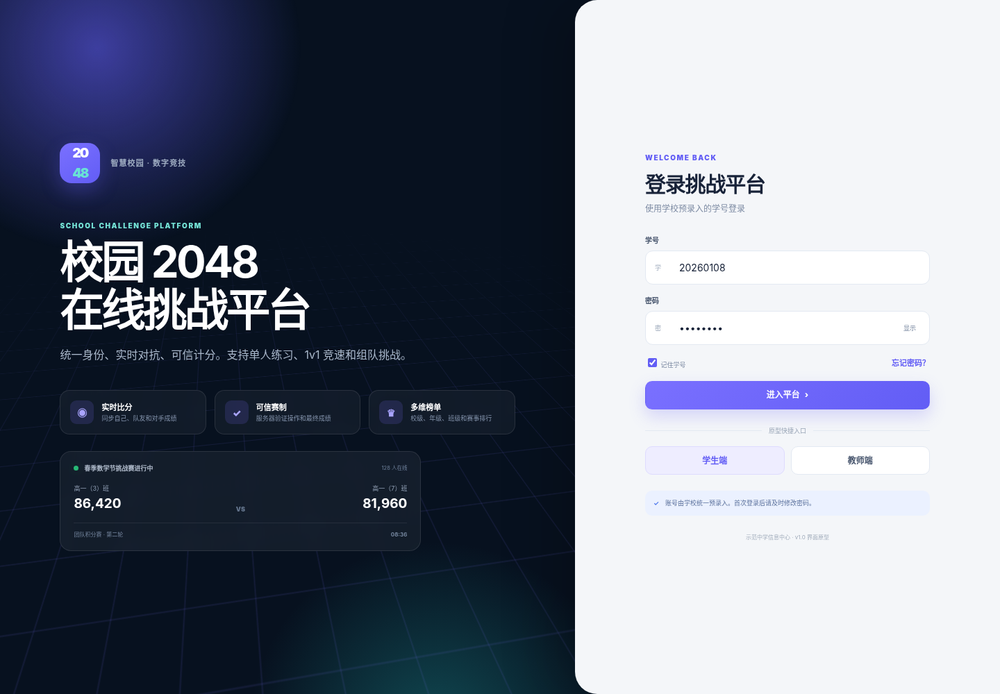


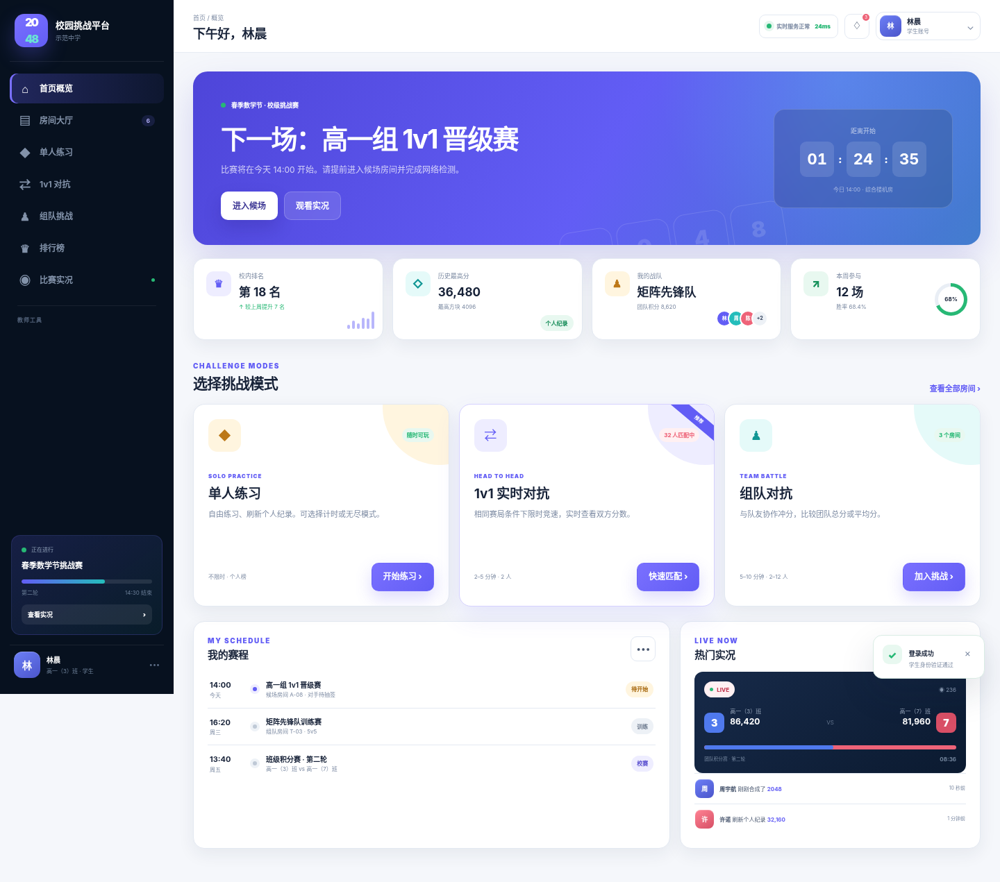


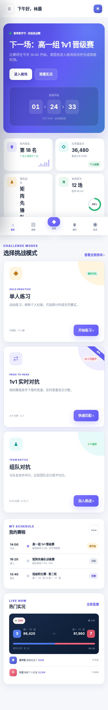

### 学生端比赛与数据

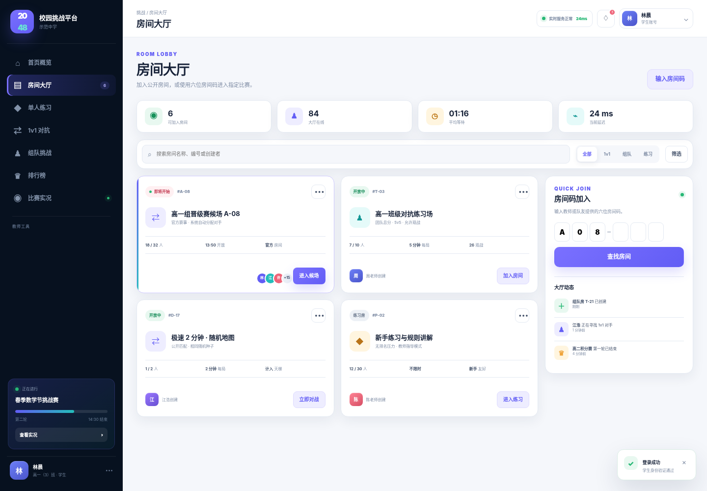

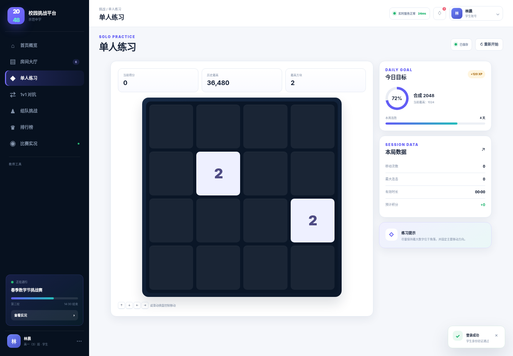

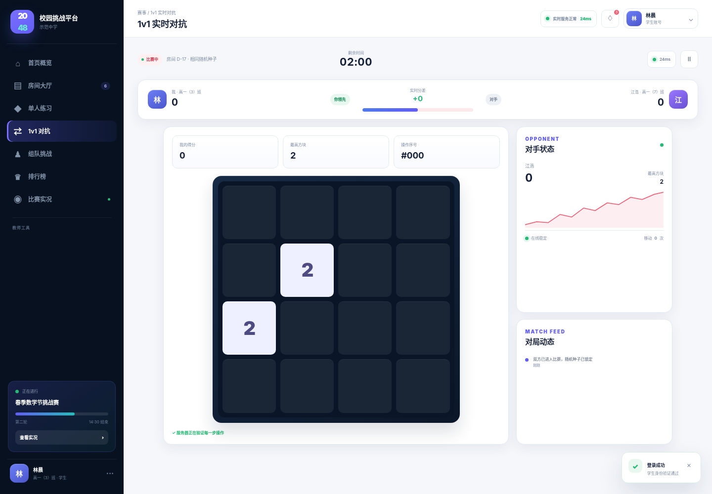

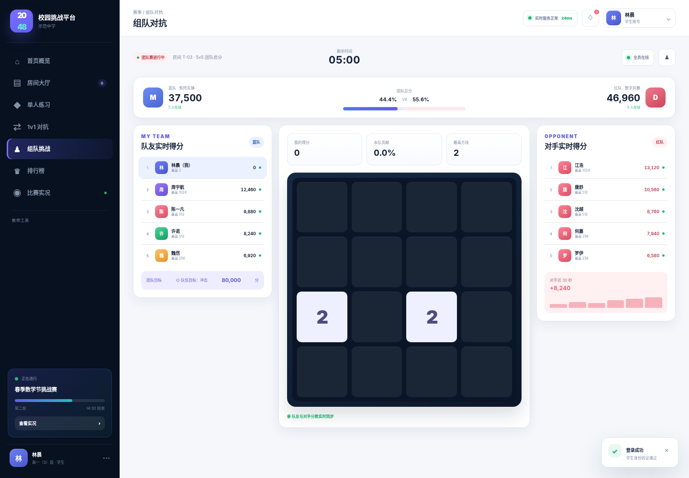

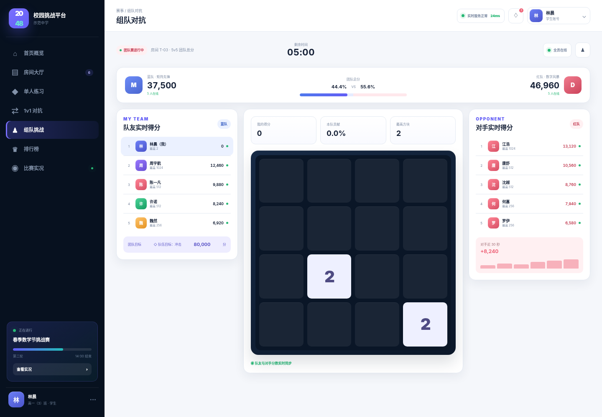

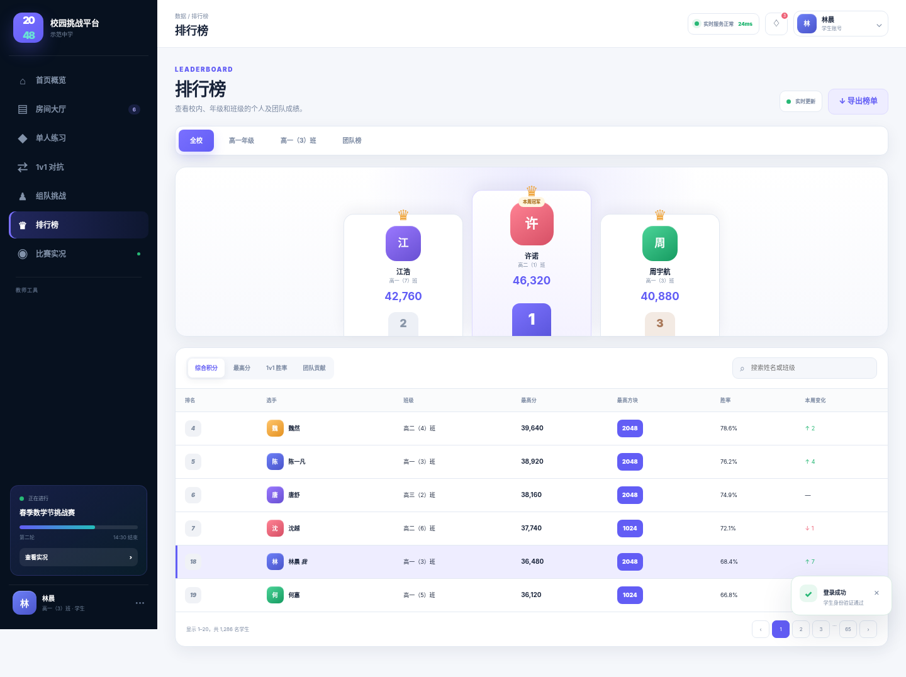

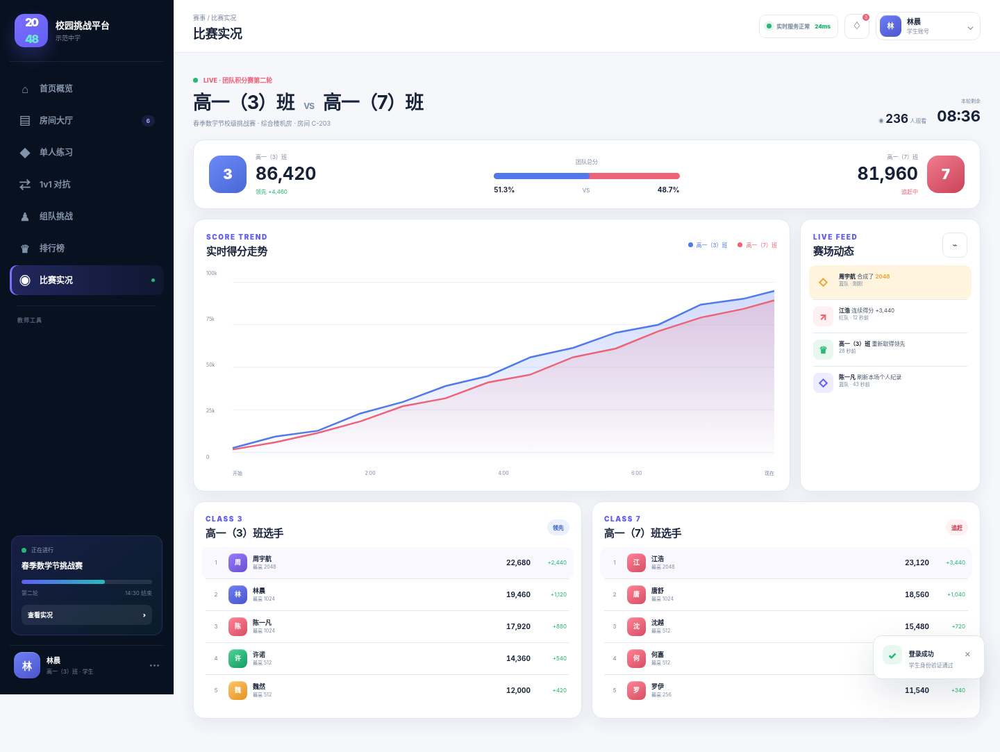

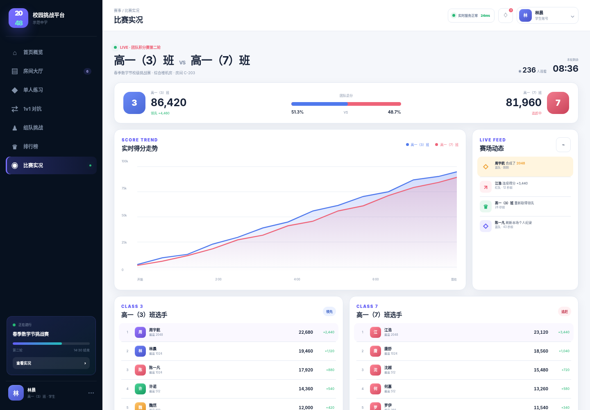

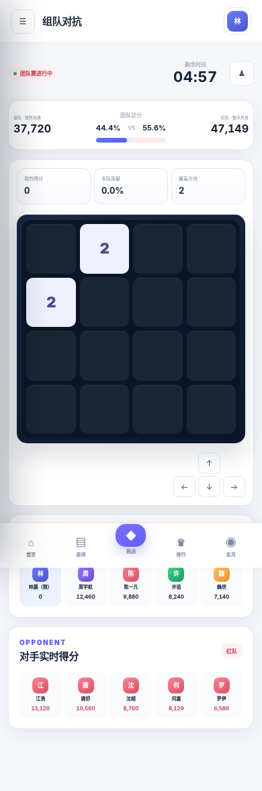

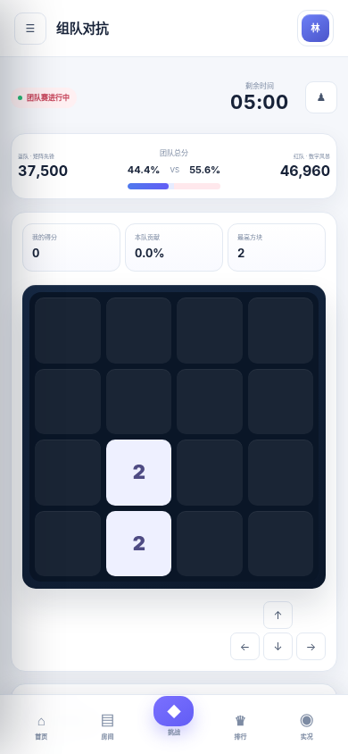

### 教师端


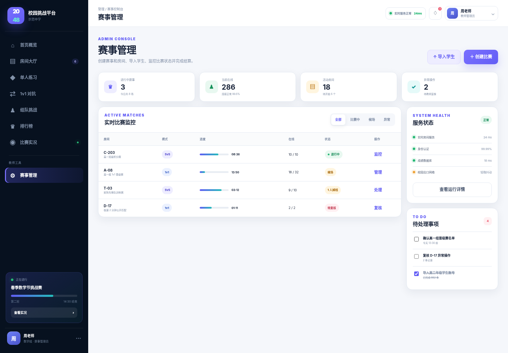

## 9. 验收清单

- [ ] 比赛房间普通模式覆盖候场、进行中、最后 60 秒和结束态。
- [ ] 个人练习从 `00:00` 开始，并在 `game over` 后冻结。
- [ ] 全屏模式上方只显示得分数字和计时数字，下方为可操作棋盘。
- [ ] 全屏模式隐藏导航、辅助卡片、操作提示和同步提示；退出后恢复页面布局。
- [ ] 桌面端、360×800 手机和 768×1024 平板无横向溢出。
- [ ] 比赛截止仍由服务端绝对时间控制，设计层不引入客户端结算逻辑。
